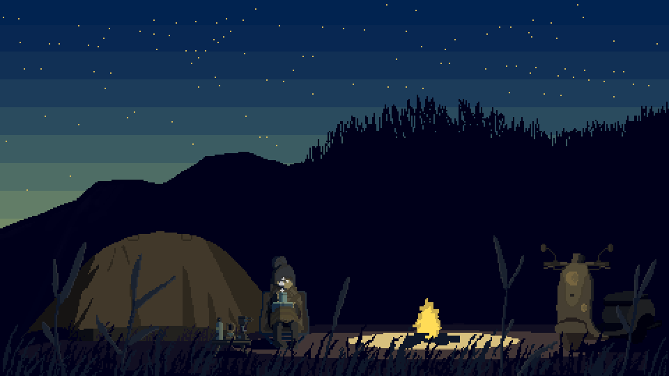

<h1>Bello, I'm Chikochi</h1>

<em>Programming Enthusiasts and Web Developer>_</em>

<h1>💫 About Me:</h1>

🔭 I’m currently studying in <i>Senior Highschool<i/>

🌱 I’m currently learning <i>C/C++ language and Javascript</i>

⚡ Fun fact: I<i>'m Photographer and Guitarist<<i/>/p>

## 🌐 Socials:
   

# 💻 Skill:
                 

# 📊  GitHub Stats:
 
 

  ## 💰 You can help me by Donating
<a href="https://trakteer.id/Chikochii" target="_blank">
  <a/>
  
### Thanks for visiting my profile github:3

