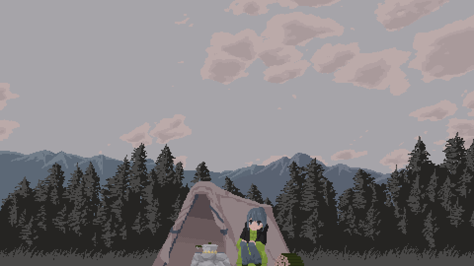

# Bello, i'm Chikochi:D

# 💫 About Me:
🔭 I’m currently studying in high school 🌱 I’m currently learning C/C++ language and Javascript 💬 Ask me about your music genre ⚡ Fun fact: I'm Photographer and Guitarist

## 🌐 Socials:
   

# 💻 Tech Stack:
                
# 📊 GitHub Stats:
 
 

---

  ## 💰 You can help me by Donating
   
  

